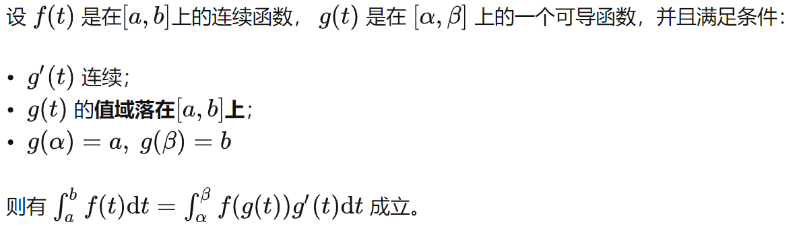

- [[高等数学]]
	- _(z-lib.org)_1667010699290_0.pdf)
	- _(z-lib.org)_1667010752484_0.pdf)
	- [[极限]]
		- $\infin - \infin$的转换 ((635cbf4d-8aac-4448-8ded-5a06afec99f4))#card
			- ((635cc710-ad00-4f1a-b0fe-c807fb105652))
		-
		- 等价无穷小替换 ((635cc106-7243-4ea1-935d-1f85b5136829)) #card
			- ((635cc80b-0914-4ec9-ad8f-8055dc26a698)) ((635cc7f4-e430-437c-835c-1d4712b25714))
		- 不适用武忠祥三部曲的$0^\infin$形式 ((635cc138-85a4-4aeb-9f74-5ca8b622ad48)) #card
			- ((635cc83a-91ef-454e-9157-616e97f9b32f))
			- 因为三部曲的要求是$\lim \alpha(x)\beta(x)$存在，但此题为$\infin$，不存在
		- 积分中含有x的极限（积分的求导） ((635cc1e2-9aaf-4659-86e3-47aab252558e)) #card
			- 
			- ((635cc89a-4534-4caf-9461-b816312c0bf9))
-
-
-